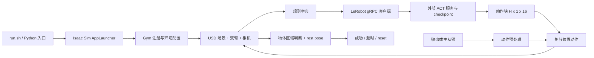

# Task3 技术文档：跨境物流小件智能分拣

本文依据本目录的实际 Python 源码编写，记录日期为 2026-09-21。覆盖场景注册、随机初始化、控制和观测契约、任务判定、数据采集与推理链路。源码来源为本机工作目录快照，并包含已有修改，不能把它等同于未改动的主办方最终评分系统。

> 核心事实：当前成功条件要求 4 个包裹全部进入名称映射指定的区域，再满足机械臂 rest pose。区域与标签类别的对应关系预先写在配置中；判定端没有运行 OCR 或标签分类网络。

## 任务与场景

| 项目 | 当前实现 |
| --- | --- |
| Gym ID | task3 |
| 环境配置类 | Task3EnvCfg |
| 仿真场景 | assets/scenes/task3/training_env.usd |
| 机器人资产 | assets/robots/x_trainer.usd |
| 场景挂载点 | {ENV_REGEX_NS}/Scene |
| 机器人挂载点 | {ENV_REGEX_NS}/Robot |
| 判定参考实体 | scene |
| reset 管理对象 | ChinaBox、ChinaBox_01、AmericaBox、UKBox |
| 随机化 | reset_tube_grid：2×2 网格分配并扰动 |
| 环境间距配置 | 8.0；整理版默认只使用 1 个环境 |

依据：[任务注册](source/leisaac/leisaac/tasks/task3/__init__.py)、[任务配置](source/leisaac/leisaac/tasks/task3/xtrainer_pickup_recognition_env_cfg.py)。

策略语言指令为：

> Put items with Chinese labels into the red basket, and others into the blue basket.

“中文入红篮，其余入蓝篮”是任务描述。当前成功函数依据对象名称和数值区域判定，不读取篮子颜色，也不读取标签文字。没有 checkpoint 时，不能宣称系统已能从图像识别国家或文字。

### 随机初始化算法

`Task3EnvCfg.__post_init__` 将 `reset_tube_grid` 作为 mode=reset 的事件，通过 [domain_randomization.py](source/leisaac/leisaac/utils/domain_randomization.py) 注册为 `domain_randomize_0`。

| 参数 | 值 |
| --- | --- |
| asset_names | 上述 4 个包裹 |
| x_range | (-0.30, 0.30) |
| y_range | (-0.10, 0.15) |
| grid_shape | (2, 2) |
| 单格宽、高 | 0.30、0.125 |
| x/y 格内扰动幅度 | ±0.06、±0.025 |
| min_center_distance | 0.05 |
| max_sample_attempts | 24 |

算法为每个环境随机排列网格编号，将不同包裹分配到不同格子，再在各自格中心加入均匀扰动。用 `torch.cdist` 检查采样点间距，24 次仍不满足则回退到格中心。有效最小间距为 `min(0.05, 0.9 * min(cell_width, cell_height))`，当前仍为 0.05。

**采样出的 x/y 是加到各对象 default_root_state 的偏移，不是统一坐标系下直接覆盖的绝对位置。** z 和四元数保留默认值，线速度与角速度清零。代码没有随机化颜色、光照、质量或相机。

间距约束只检查“采样偏移点”，没有结合不同对象的默认位置、检测点修正和实际几何尺寸，所以不能保证包围盒完全不重叠。此外写入 root_state 时没有显式加 `env.scene.env_origins`，扩展到多环境需先验证；当前单环境 smoke 不覆盖这一问题。

## Task3 成功判定

### 区域与对象映射

配置见 [xtrainer_pickup_recognition_env_cfg.py](source/leisaac/leisaac/tasks/task3/xtrainer_pickup_recognition_env_cfg.py)。以下范围按当前场景的米制坐标使用。

| 区域 | 对象 | x 范围 | y 范围 | z 范围 |
| --- | --- | --- | --- | --- |
| china_zone | ChinaBox、ChinaBox_01 | (0.61, 0.79) | (-0.06, 0.2) | (-0.05, 0.18) |
| western_zone | AmericaBox、UKBox | (0.26, 0.44) | (-0.06, 0.2) | (-0.05, 0.18) |

参考名称为 `scene`。位置读取函数如果不能从该实体取得 root 数据，就返回 `env.scene.env_origins`，因此应理解为相对场景/环境原点的范围，而不是动态跟随收纳盒本体的区域。移动 USD 中的篮子不会自动更新这张表。

`TASK3_OFFSET_FRAME="local"`；以下补偿是资产局部原始数值，会先按 USD 缩放，再随物体姿态旋转：

| 对象 | object_offset |
| --- | --- |
| ChinaBox | (4.3057, -3.9465, 0.02607) |
| ChinaBox_01 | (4.30873, -3.94194, 0.0206) |
| AmericaBox | (0, 0, 0) |
| UKBox | (4.30654, -3.96032, 0.02865) |

这些看似数米量级的数值不能直接当作世界坐标位移。它们与 USD 的局部原点、缩放和视觉中心校正共同决定检测点。更换或重新导出资产后需重新标定，不能盲目沿用。

### 布尔表达式

[terminations.py](source/leisaac/leisaac/tasks/task3/mdp/terminations.py) 对每个对象使用 AND：

```text
success = in_region(ChinaBox, china_zone)
          AND in_region(ChinaBox_01, china_zone)
          AND in_region(AmericaBox, western_zone)
          AND in_region(UKBox, western_zone)
          AND robot_at_rest
```

判定前先检查每个对象是否映射到合法区域、每个区域是否至少存在一个映射对象；配置不完整时返回全 False。

它与 Task2 的“每区域有任一候选物体”不同。任意一个包裹在错误区域、区域外或边界上，都不能触发成功。代码不计算“投进任意篮子”的完成性分数，也没有针对塑料袋变形或破损的专用判定。

### 检测点与边界

检测采用仿真真值，不是图像检测框。任务 `mdp/observations.py` 的 `get_object_detection_pose_w` 优先读取 root link 位姿，缺少时回退到 root 位姿。

设根位置为 p、姿态旋转为 R、USD 世界缩放向量为 s、缓存的局部包围盒中心为 c，配置偏移为 o：

```text
local offset:  p_detect = p + R(s * c) + R(s * o)
world offset:  p_detect = p + R(s * c) + o
```

星号表示逐轴相乘。成功函数均启用 `apply_object_scale` 与 `use_visual_center_anchor`。所谓“视觉中心”是 USD 包围盒中心的启发式处理结果，并非相机图像推断的中心，也未必等于物体质心。

区域判断直接比较检测点与参考位置的坐标差，x/y/z 均采用严格的 `>` 与 `<`，落在边界上不算进入。没有将差向量变换到容器旋转坐标系，所以这些区域是世界轴对齐范围；旋转容器不会自动旋转判定盒。

判定检查的是一个点，不检查整个物体包围盒是否被容器包住，也没有成功后持续稳定若干帧的要求。

### 机械臂 rest pose

两任务最终都调用 [robot_utils.py](source/leisaac/leisaac/utils/robot_utils.py) 的 `is_xtrainer_at_rest_pose`。

[xtrainer.py](source/leisaac/leisaac/assets/robots/xtrainer.py) 中 `XTRAINER_FOLLOWER_REST_POSE_RANGE` 定义了两次，第二次覆盖第一次。**当前生效范围是全部 16 个关节均为 (-30, 30)，不是前一段的机械臂 ±5°。**

函数先对所有 joint_pos 乘 180/π，再进行严格范围比较。对转动关节可解释为 ±30°；夹爪是直线位移，也被同样转换，单位语义不正确。正常夹爪行程 0.04 转换后约为 2.29，仍落在范围内，因此这个检查通常不能证明夹爪已经打开。文档记录现状，本次未修改判定代码。

### DetectionZone 可视化

`create_detection_zone_visualization` 创建 USD Xform、Cube 和透明材质；`create_object_detection_point_visualization` 创建标记点。这里没有给新增可视几何施加碰撞或刚体 API。检测盒是调试显示，不是额外的待搬运物体。

创建受 `enable_visualization` 控制。默认启动脚本关闭；遥操作需要调试时可以追加 `--enable_visualization`。检测点随更新函数移动；区域盒主要在初始化时创建，参考物体后续移动时不保证显示盒同步跟随，但成功函数仍会读取实时参考位置。训练和策略评测时应保持画面配置一致，避免调试几何进入相机图像。

### Task3 视觉中心校正

[observations.py](source/leisaac/leisaac/tasks/task3/mdp/observations.py) 与 Task2 有一处重要区别：初始包围盒中心范数大于 0.25 时，使用 USD world transform 的逆矩阵生成第二个局部中心候选，然后选择范数较小的候选。该结果与缩放都被缓存。

检测点是“根位置 + 经旋转缩放的中心 + 经旋转缩放的配置偏移”，不是简单的 `root_pos + object_offset`。如果 USD 原点或几何层级改变，应一起复核中心缓存与上述补偿，避免重复补偿。

## 系统结构

本仓库实现的是仿真环境、遥操作采集和远程策略推理接入。未包含训练好的 ACT 模型，也没有可独立完成任务的抓取状态机或路径规划器。环境知道物体的仿真状态，用于 reset 和结果判断；这不代表策略已具备视觉识别能力。



两个任务通过各自 `__init__.py` 调用 `gym.register`，环境入口均为 `isaaclab.envs:ManagerBasedRLEnv`，并关闭 Gym 环境检查器。主程序必须显式 `import leisaac.tasks` 完成注册；仅导入 `leisaac` 不会自动注册。

公共环境配置见 [xtrainer_arm_env_cfg.py](source/leisaac/leisaac/tasks/template/xtrainer_arm_env_cfg.py)。任务配置继承该模板，再替换场景、成功条件和 reset 逻辑。奖励配置为空，因此这份代码没有用于训练的稠密奖励函数。

### 资产加载和路径

[constant.py](source/leisaac/leisaac/utils/constant.py) 优先使用 `LEISAAC_ASSETS_ROOT`。整理版 [run.sh](run.sh) 将该变量设置到本仓库 `assets/`，并把本仓库源码加入 `PYTHONPATH`。

[general_assets.py](source/leisaac/leisaac/utils/general_assets.py) 中的 `parse_usd_and_create_subassets` 遍历 USD，按任务给定名称筛选刚体或关节系统，在 `env_cfg.scene` 注册对应实体。两任务均使用 `pose_reference="scene_root"`；刚体配置绑定已经存在的场景 prim，用于统一读取状态和 reset，并不是额外复制一套物体。

Isaac Sim、Isaac Lab、LeRobot 和模型权重属于外部运行依赖。来源与打包边界见 [PROVENANCE.md](PROVENANCE.md)。

## 机械臂、控制与时间

### 动作契约

机器人配置见 [xtrainer.py](source/leisaac/leisaac/assets/robots/xtrainer.py)。虽然文件注释仍提到四臂，当前 Python 动作配置控制两条机械臂，每臂 6 个转动关节和 2 个夹爪关节，共 16 维：

| 动作下标 | 关节 | 含义 |
| --- | --- | --- |
| 0–5 | J1_1 … J1_6 | 左臂关节位置，弧度 |
| 6–7 | J1_7、J1_8 | 左夹爪位移，米 |
| 8–13 | J2_1 … J2_6 | 右臂关节位置，弧度 |
| 14–15 | J2_7、J2_8 | 右夹爪位移，米 |

主从臂与 ACT 路径使用 `xtrainerleader` 动作类型，四组 `JointPositionActionCfg` 的 scale 都为 1.0。ACT 返回值直接按仿真动作使用，不在 X-Trainer 客户端中转换为角度，也不做 0–1 夹爪归一化。默认关节初始值为 0；若改变初始值，应重新核对相对观测与动作偏置。

夹爪限位为 `J*_7 ∈ [-0.04, 0]`、`J*_8 ∈ [0, 0.04]`；配对的负、正位移表示闭合方向。键盘路径的夹爪 scale 为 0.7，机械臂 scale 为 1.0，和策略路径并不完全相同。训练数据如果来自键盘采集，需要核对记录的原始 action 与实际关节目标之间的缩放关系。

实现入口：[action_process.py](source/leisaac/leisaac/devices/action_process.py) 的 `init_action_cfg`、`preprocess_device_action`；关节顺序也定义于 [constant.py](source/leisaac/leisaac/utils/constant.py) 的 `XTRAINER_DUAL_JOINT_NAMES`。

### 驱动参数

| 分组 | 关节 | effort_limit_sim | velocity_limit_sim | stiffness | damping |
| --- | --- | ---: | ---: | ---: | ---: |
| 肩部 | 每臂 1–3 | 200 | 10 | 800 | 80 |
| 前臂 | 每臂 4–6 | 200 | 10 | 200 | 20 |
| 夹爪 | 每臂 7–8 | 50 | 1 | 400 | 40 |

以上为配置数值，旋转和直线关节不能混用力矩、力及速度单位。夹爪参数可由 `XTRAINER_GRIPPER_EFFORT_LIMIT_SIM`、`XTRAINER_GRIPPER_VELOCITY_LIMIT_SIM`、`XTRAINER_GRIPPER_STIFFNESS`、`XTRAINER_GRIPPER_DAMPING` 覆盖。

根节点固定，启用重力与自碰撞，位置和速度求解迭代数均为 4。任务配置把机器人基座位置设为 `(0, 0, 0.1)`，四元数设为 `(1, 0, 0, 0)`，覆盖通用机器人配置。

`dynamic_reset_gripper_effort_limit=True` 不表示 X-Trainer 会自动按物体质量调夹持力：[env_utils.py](source/leisaac/leisaac/utils/env_utils.py) 的对应函数没有处理 `xtrainerleader` 或 `bi_keyboard` 分支，这两条路径当前不执行该动态调整。

### 时间基准

| 参数 | 实际配置 |
| --- | --- |
| 物理步长 | 1/120 秒 |
| decimation | 2 |
| 每次 env.step 推进 | 1/60 仿真秒 |
| CCD | 启用 |
| 通用模板 episode_length_s | 8 秒 |
| 策略脚本原始 episode_length_s 默认值 | 60 秒 |
| 整理版 run.sh eval 默认值 | 40 秒、1 轮 |
| 策略脚本 step_hz | 默认 60，限制墙钟执行频率 |
| 遥操作脚本 step_hz | 默认 30，run.sh 未覆盖 |
| 普通策略相机更新周期 | 1/30 秒 |

`step_hz` 不会修改物理步长；30 Hz 遥操作循环和 60 Hz 仿真控制时间不是同一概念。模型训练 fps、相机更新率、动作执行频率与真实耗时应分别记录，不能通过修改一个参数就假定全部同步。

## 观测和策略服务

### 相机与状态

[公共观测配置](source/leisaac/leisaac/tasks/template/xtrainer_arm_env_cfg.py) 以字典返回 `obs["policy"]`，没有拼成单一向量。

| 字段 | 内容 |
| --- | --- |
| left_joint_pos_rel / right_joint_pos_rel | 每臂 8 维相对默认位置 |
| left_joint_vel_rel / right_joint_vel_rel | 每臂相对默认速度 |
| left_joint_pos_target / right_joint_pos_target | 每臂关节目标 |
| actions | 上一次动作 |
| top / left_wrist / right_wrist | RGB 图像，normalize=False |

配置虽令 `enable_corruption=True`，但这些观测项没有显式噪声参数，不能据此宣称已实现图像或状态噪声增强。

| 相机 | 挂载参考 | 位置偏移 | 欧拉角配置 | 分辨率 |
| --- | --- | --- | --- | --- |
| left_wrist | J1_6 | (0, -0.065, 0.03) | (-15°, 0, 0) | 640×480 |
| right_wrist | J2_6 | (0, -0.065, 0.03) | (-15°, 0, 0) | 640×480 |
| top | base_link | (0.53, -0.55, 1.0) | (-148°, 0, 0) | 640×480 |

相机 convention 为 `ros`，三路配置的 focal_length=26.8、horizontal_aperture=36.83、clipping_range=(0.01, 50)。另有两路 1280×720 的立体相机供 VR 使用，但 X-Trainer ACT 分支显式只发送上述三路图像。配置中的相机位置是相对于其挂载参考的偏移，不是可直接使用的世界坐标。

### 远程推理协议

[policy_inference.py](scripts/evaluation/policy_inference.py) 的 `xtrainer_act` 分支创建 [LeRobotServicePolicyClient](source/leisaac/leisaac/policy/service_policy_clients.py)，服务端 policy_type 实际为 `act`。

1. 创建 gRPC channel，调用 `Ready`。
2. 将 `RemotePolicyConfig` 序列化后发送给 `SendPolicyInstructions`，其中含服务端 checkpoint 路径、特征定义、动作块长度和 device。
3. 三路图像转为第 0 个环境的 uint8 HWC 数组；左右位置拼接为 16 维状态，以 `J1_1.pos` 等字段发送。附加任务语言文本。
4. `TimedObservation` 通过 `SendObservations` 分块发送；随后轮询 `GetActions`。
5. 返回动作拼成 `[H, 1, 16]`，依次执行最多 `policy_action_horizon` 步，再读取新观测并请求下一块。

因此，虽使用 LeRobot 的异步协议，这个客户端执行循环是“请求一块、执行一块”，不是在本地实现逐步后台重规划。动作块内没有新的策略请求。

`policy_timeout_ms` 控制空动作回复的轮询期限；gRPC 调用本身没有传入独立 deadline，不能把该参数当作每个 RPC 的硬超时。外层 `timeout` 才负责限制进程总耗时。服务持续返回空块时，客户端复用最后动作；尚未获得动作时初值为零目标，不等于读取并保持当前实测关节位置。

客户端可选夹爪锁存 `XTRAINER_GRIPPER_LATCH=1`，默认关闭。阈值默认闭合 0.012、打开 0.006，最短锁存步数 30，打开确认数 10；这些计数发生在遍历预测动作块时。启用会改变原始模型输出，不能当作模型本身的能力。统计可写入 `XTRAINER_POLICY_ACTION_STATS_PATH`，动作详细输出由 `XTRAINER_POLICY_VERBOSE_ACTIONS=1` 控制。

客户端与转换脚本注释指向 LeRobot v0.3.3，但仓库没有依赖锁文件；兼容性仍须按实际环境验证。当前包无法确定 ACT 的网络层数、视觉骨干、损失权重、训练轮数或真实成功率，因为这些信息依赖缺失的模型配置和训练产物。

## 采集、转换与模型边界

### 遥操作采集

入口为 [teleop_se3_agent.py](scripts/environments/teleoperation/teleop_se3_agent.py) 和 [BiKeyboard](source/leisaac/leisaac/devices/keyboard/bi_keyboard.py)。该键盘实现实际发送关节目标，不是笛卡尔末端位置命令。

| 操作 | 键位 |
| --- | --- |
| 开始控制 | B |
| 左臂关节 1–6 | Q / W / E / A / S / D |
| 右臂关节 1–6 | U / I / O / J / K / L |
| 左、右夹爪 | G / H |
| 负方向 | 先按住 Z，再按对应关节键 |
| 失败重置 / 成功标记并重置 | R / N |

键盘每次控制更新累加关节目标并按限位裁剪；机械臂默认增量由 `0.06 * sensitivity` 给出，夹爪增量为 0.005。这里是每次更新的增量，不应直接解释为 rad/s。

未按 B 时 `Device.advance` 返回 None，主循环只渲染。因此“启动后不执行任务”符合该入口设计。非录制模式保留任务成功条件，但关闭任务时间限制。录制模式会把成功条件换成人工标记，并使用 `StreamingRecorderManager`：每 100 步刷写，压缩为 lzf，支持 `--resume`。

**录制时按 N 的 success 标签是人工声明，不能作为自动判定通过的证据。** 数据集质量仍需回放检查。

### 通用 HDF5 转换

[isaaclab2lerobot_xtrainer.py](scripts/convert/isaaclab2lerobot_xtrainer.py) 从每个 demo 读取：

```text
data/demo_*/
  actions
  obs/left_joint_pos_rel
  obs/right_joint_pos_rel
  obs/top
  obs/left_wrist
  obs/right_wrist
```

拼接左右状态为 16 维，action 与 state 转 float32，三路图像作为 video 特征写入 LeRobot。存在 `success=False` 的 demo 跳过；缺少 success 属性的 demo 仍可能被接收，不能简单称为“只包含认证成功样本”。

通用脚本默认 fps=30，少于 10 帧跳过，每段丢弃前 5 帧，并断言各模态帧数相同。文件名、repo_id、任务描述仍是抓方块示例，必须按本任务修改；修改 fps 元数据不会自动完成重采样。

训练调用依赖外部 LeRobot；原 README 的训练命令属于示例。仓库不包含训练完成的 checkpoint，也不具备仅靠自然语言指令就自动完成任务的能力。

## 启动、评测与日志

完整环境安装和 Git LFS 操作见 [README.md](README.md)。三个入口共用 [run.sh](run.sh)：

```bash
bash run.sh smoke
bash run.sh teleop
POLICY_CHECKPOINT=/path/visible/to/server/pretrained_model bash run.sh eval --headless
```

eval 前须在兼容 LeRobot 环境启动服务，例如：

```bash
python -m lerobot.async_inference.policy_server --host=127.0.0.1 --port=5555 --fps=30
```

`--fps=30` 与上游服务示例一致；接入自己的模型时需核对其训练时基与运行参数。checkpoint 路径由服务端读取；服务在容器中时必须使用容器可见路径。

| run.sh 环境变量 | 默认值 / 含义 |
| --- | --- |
| ISAAC_SIM_ROOT | 必填，Isaac Sim 安装目录 |
| ISAACLAB_ROOT | 可选，本机 Isaac Lab 源码目录 |
| POLICY_CHECKPOINT | eval 必填，服务端模型路径 |
| POLICY_HOST / POLICY_PORT | 127.0.0.1 / 5555 |
| POLICY_ACTION_HORIZON | 16 |
| SEED | 123 |
| EPISODE_LENGTH_S | 40 仿真秒 |
| RUN_TIMEOUT_S | teleop 3600；smoke / eval 180 墙钟秒 |

配置可以放入忽略上传的 `local.env`，脚本会 source 它；其中显式赋值会覆盖同名的调用环境变量。额外 CLI 参数在默认参数之后传给 Python。外层超时先发 TERM，10 秒后仍未结束则 KILL。

评测脚本默认单环境，正常结束输出每轮成功/超时和 `Final success rate`。底层 ManagerBasedRLEnv 在 step 内会重置已结束的环境。当前每轮结束不重建 policy 对象，因此 `last_action` 和可选夹爪锁存状态可能跨轮保留；跨多轮的实验应核对状态隔离。整理版默认一轮。

| 日志 / 返回 | 含义 |
| --- | --- |
| SMOKE_RESULT 中 status=passed | 环境最小检查通过，不是任务完成 |
| Episode … is successful | 当前代码的成功条件被触发 |
| Episode … timed out | 仿真回合时间达到限制 |
| Final success rate | 完成轮次中的成功统计，不是比赛分数 |
| RUN_EXIT_CODE=0 | 进程正常退出，即使任务失败也可能为 0 |
| RUN_EXIT_CODE=124 | 外层 timeout 到期的常见返回值 |
| Traceback | Python 异常，需与动作未成功区分 |

原始日志写到 `logs/`。现有 run.sh 只自动保存文本日志，没有自动截图或录屏功能。需要图像证据时必须另行配置相机帧导出或录屏，不能把无相机 smoke 当作渲染验证。

## Task3 专属工具与实现边界

### 专用数据转换脚本

[convert_task3_0428_success.py](scripts/convert/convert_task3_0428_success.py) 支持多个 HDF5 输入、按数字排序 demo、默认 60 fps、不丢弃首帧，并提供编码器与写入线程参数。默认任务文本已经是 Task3。少于等于 `max(10, skip_initial_frames)` 的样本被跳过；有 `success=False` 的样本被过滤，无 success 属性的样本并不会自动拒绝。

```bash
# 在 LeRobot 环境执行；输入文件和输出目录需要实际存在/可创建
python scripts/convert/convert_task3_0428_success.py \
  --input-files datasets/task3_a.hdf5 datasets/task3_b.hdf5 \
  --root datasets/lerobot_task3 \
  --repo-id local/task3 \
  --fps 60
```

与通用转换器相比，该脚本保留首帧有助于与记录的初始状态对齐，但不能证明动作与观测已经正确同步；仍需回放检查。整段 demo 图像一次读入内存，长轨迹会提高内存占用。它不显式断言所有模态帧数相等。`--overwrite` 会删除已有输出目录，使用时需确认路径。设置 fps 只改变写入时基，不会自动插值出新的图像帧。

### 推理保护与诊断

[policy_inference.py](scripts/evaluation/policy_inference.py) 还包含以下 Task3 专用功能：

| 功能 | 开关与行为 |
| --- | --- |
| 首次接近动作缩放 | XTRAINER_TASK3_FIRST_GRASP_PROTECT_STEPS 默认 0，关闭 |
| 缩放系数 | XTRAINER_TASK3_FIRST_GRASP_ARM_SCALE 默认 0.75 |
| 轨迹日志 | XTRAINER_TASK3_TRAJ_LOG 指定 JSONL 路径 |
| 超时诊断 | print_task3_timeout_diagnostics，输出各轴与入区布尔值 |

启用接近缩放后，前若干步仅将 12 个机械臂关节目标改为 `q_current + scale * (q_target - q_current)`，不改变四个夹爪动作，也没有依据视觉识别“第一次抓取”。`rollout_step` 在外层循环初始化一次，不会自动按每轮归零，因此多轮时不能把它理解成每轮独立的保护窗口。

轨迹记录包含左右末端 frame 位置、经过修正的包裹检测点、关节位置和动作。末端 frame 指向 J1_6/J2_6，不等同于已标定的夹爪指尖；joint_pos 使用机器人原生关节顺序，而 action 使用固定 16 维动作顺序，比对时应按名称映射。

**超时日志的时间点存在限制。** 本机使用的 Isaac Lab `ManagerBasedRLEnv.step` 在内部先计算终止，再 reset 结束环境，最后返回。当前轨迹日志和 Task3Diag 都在 `env.step` 返回后读取场景，所以终止那一步可能看到的是新回合状态，不是失败瞬间。不能仅凭该日志重建最终失败姿态。应在 pre-reset 时捕获终态，或结合终止前连续帧；这属于后续改进，本次未修改代码。

另外，policy 对象、last_action 和可选夹爪锁存状态跨轮保留，做多轮统计前应显式验证状态重置。

## 与赛题评分的对应关系

以下公式来自本次需求中提供的赛题摘录，作为业务要求对照，不表示本仓库已经实现它们。

| 评分项 | 赛题要求 | 当前代码 |
| --- | --- | --- |
| 准确率，6 分 | 6 × 正确分类投放数 / N | 4 个对象全部正确的布尔判定，没有部分得分 |
| 完成性，2 分 | 2 × 投入任意收纳盒的数量 / N | 不单独统计错误分类但已投放的数量 |
| 效率，2 分 | max((t0 - t) / t0 × 2, 0) | 有 episode 超时，没有效率得分 |
| 同分排序 | 准确率优先，其次完成性 | 未实现排序器 |

对象名称到区域的映射是仿真环境的真值标签，不是 OCR 模型结果。当前配置也没有覆盖所有可能的塑料袋和纸盒变体。不能仅凭 Task3 成功日志宣称具备真实跨境物流泛化能力或比赛满分。

## 验证结果与后续工作

已有包装验证见 [VALIDATION.md](VALIDATION.md)：Isaac Sim 4.5.0、本机 Isaac Lab VERSION 2.3.2，seed=123，创建环境、reset 和 3 次零动作 step 完成；动作维度为 [1,16]，关闭相机，不涉及训练策略。

本次编写文档还抽取原 `task_done` 和 `is_xtrainer_at_rest_pose` 函数，在 CPU Torch 上以模拟检测点调用。以下结果仅验证判定逻辑，不包含 USD 检测点校正、随机化、碰撞或抓取执行。

| 条件 | 原函数返回 |
| --- | --- |
| 四个包裹均在对应区，关节为零 | True |
| 仅 UKBox 移出对应区 | False |
| 区域存在但 object_region_map 为空 | False |
| rest 检查中 J1_1=1 rad | False |
| rest 检查中其他关节零、J1_8=0.04 | True |

本次只新增技术文档与导航、更新校验和，没有调整任务算法。仍未验证 ACT 模型执行、OCR/视觉标签理解、完整相机渲染和实机操作。

后续应优先核对 USD 检测点、采样后实际物体间距和标签映射；补齐逐件正确投放/任意投放计数与官方时基；在 pre-reset 保存终态；再验证多 seed、多轮策略状态清理、数据频率和模型输入契约。扩大到多环境之前需处理或验证随机化中 env_origins 的使用。

## 代码阅读索引

| 文件 | 关键入口 |
| --- | --- |
| [task3 配置](source/leisaac/leisaac/tasks/task3/xtrainer_pickup_recognition_env_cfg.py) | Task3EnvCfg、reset_tube_grid |
| [task3 判定](source/leisaac/leisaac/tasks/task3/mdp/terminations.py) | task_done、对象和区域合法性检查 |
| [task3 几何与显示](source/leisaac/leisaac/tasks/task3/mdp/observations.py) | get_detection_point_pos_w、视觉中心候选校正 |
| [随机事件注册](source/leisaac/leisaac/utils/domain_randomization.py) | domain_randomization |
| [共享模板](source/leisaac/leisaac/tasks/template/xtrainer_arm_env_cfg.py) | 相机、观测、事件、时间配置 |
| [策略客户端](source/leisaac/leisaac/policy/service_policy_clients.py) | LeRobotServicePolicyClient |
| [推理及诊断](scripts/evaluation/policy_inference.py) | main、首次接近保护、轨迹与超时诊断 |
| [专用转换器](scripts/convert/convert_task3_0428_success.py) | process_demo、features_with_fps |
| [通用转换器](scripts/convert/isaaclab2lerobot_xtrainer.py) | process_xtrainer_data |
| [录制管理](source/leisaac/leisaac/enhance/managers/recorder_manager.py) | StreamingRecorderManager |
